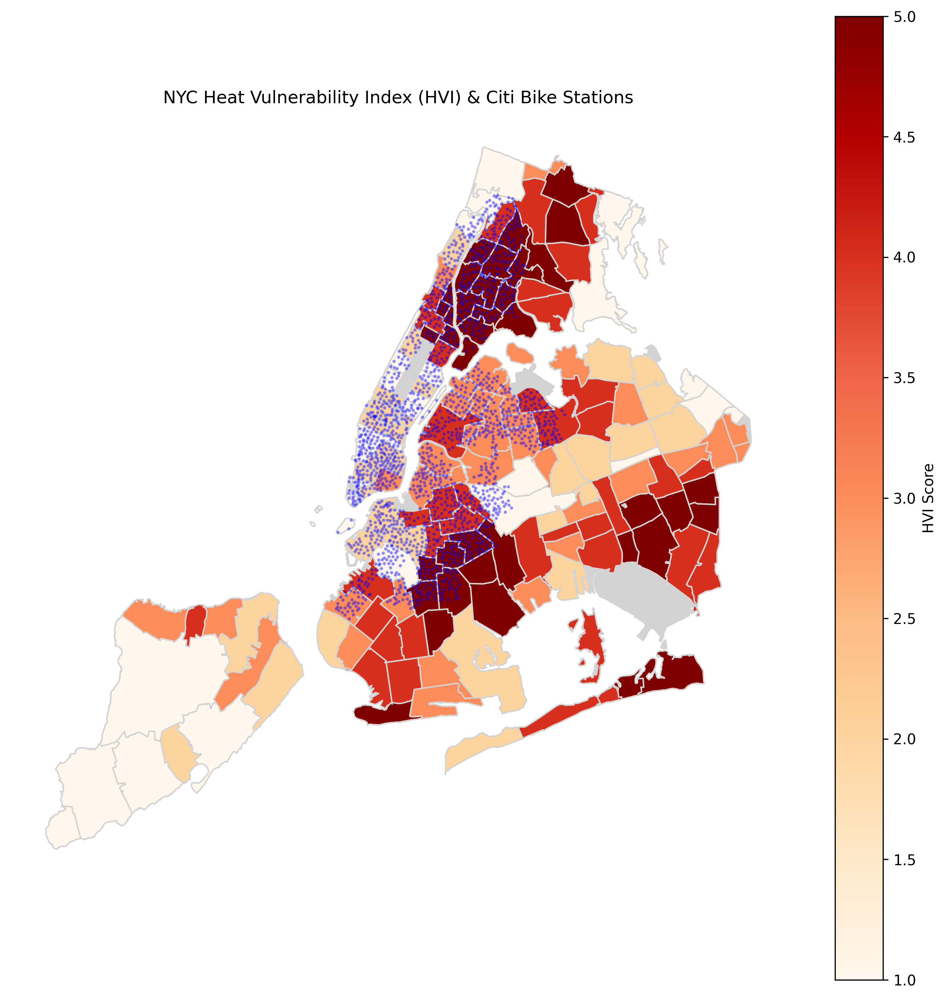
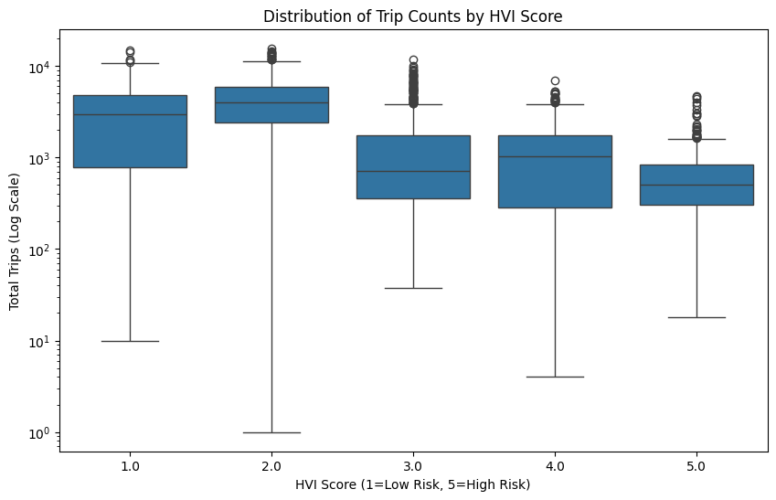

# Urban Heat Island & Citi Bike Analysis
**DSA 210 Introduction to Data Science - Term Project**

**Student**: Raid Bahadir
**Date**: January 9, 2026

---

## 1. Motivation
New York City experiences significant temperature variations due to the "Urban Heat Island" (UHI) effect, where concrete-dense areas trap more heat than greener neighborhoods. At the same time, the city is promoting sustainable mobility through the Citi Bike bikeshare system.

This project investigates a core question: **Does the Urban Heat Island effect deter cycling?** By analyzing millions of bike trips against heat vulnerability data, we aim to understand if riders avoid hot zones, which could inform city planning for cooling infrastructure (e.g., shaded bike lanes).

## 2. Data Source & Collection

### 2.1 Primary Dataset: Citi Bike Trip Histories
- **Source**: [Citi Bike System Data](https://s3.amazonaws.com/tripdata/index.html)
- **Data Used**: August 2024 Trip Data (Peak Summer).
- **Collection**:
    - Downloaded monthly CSV files (`202408-citibike-tripdata_*.csv`).
    - **Note**: The dataset is extremely large (~4.6 Million trips), so it is processsed in chunks.

### 2.2 Enrichment Dataset: Heat Vulnerability Index (HVI)
- **Source**: NYC DOHMH Heat Vulnerability Index.
- **Content**: A 1-5 score (1=Coolest/Safest, 5=Hottest/Most Vulnerable) assigned to each NYC Zip Code Tabulation Area.
- **Enrichment Logic**: 
    1.  **Spatial Join**: We map every Citi Bike station (Lat/Lon) to a Zip Code using a GeoJSON polygon map (`nyc-zip-code-tabulation-areas-polygons.geojson`).
    2.  **Merge**: We merge the station data with the HVI dataset based on Zip Code.
    3.  **Result**: Each station is tagged with an `HVI_Score`, allowing us to correlate trip counts with local heat vulnerability.

## 3. Data Analysis Pipeline
The project follows a reproducible pipeline implemented in Python:

1.  **Data Loading (`data_loader.py`)**:
    -   Glob pattern matches all `*_citibike-tripdata_*.csv` files.
    -   Aggregates over **4.6 Million trips** to calculate `total_trips` per station.
    -   Extracts station coordinates.

2.  **Geospatial Processing**:
    -   Converts station coordinates to Shapely points.
    -   Performs a **Point-in-Polygon** spatial join with NYC Zip Code boundaries.
    -   Merges result with HVI Rankings.

3.  **Statistical Analysis (`analysis.py`)**:
    -   **Hypothesis Testing**: Performs a **Mann-Whitney U Test** to determine if strict differences exist between trip counts in High HVI (4-5) vs. Low HVI (1-2) zones.
    -   **Regression Modeling**: I chose to use a **Poisson Regression** model (`total_trips ~ HVI_Score`) instead of a standard Linear Regression.
        -   *Reasoning*: Linear regression assumes data is continuous and can be negative, but trip counts are discrete non-negative integers (0, 1, 2...). Poisson regression is specifically designed for this kind of "count data" and gives a better fit for the distribution.
        The relationship is formally modeled as:
> ln(total_trips) = β₀ + β₁ * HVI_Score

4.  **Visualization (`generate_plots.py` / `eda.ipynb`)**:
    -   Generates a choropleth map of NYC HVI scores overlaid with bike stations.
    -   Plots distribution of trip counts across valid HVI scores.

## 4. Implementation Challenges
During the project, I encountered several technical hurdles that required specific solutions:

1.  **Coordinate System Mismatches**:
    One of the biggest issues I faced was that the Citi Bike data provided simple Latitude/Longitude coordinates (EPSG:4326), but I wasn't sure if the GeoJSON file used the same projection. At first, the spatial join returned zero results. I had to explicitly check and use `.to_crs()` in `geopandas` to ensure both datasets were using the same coordinate reference system before the merge would work.

2.  **Memory Issues with Large Data**:
    The raw Citi Bike CSVs were massive (several gigabytes for just one month). Trying to load them all at once caused my computer to crash. I solved this by using `glob` to find the files and loading them into a list of DataFrames before concatenating, rather than processing everything effectively. In the future, I would probably process them in chunks or use a database.

## 5. Findings
Analysis of the August 2024 dataset yields significant results:

-   **Riders Prefer Cooler Zones**: There is a statistically significant difference (Mann-Whitney U, p < 0.001) in ridership between cooler and hotter neighborhoods.
-   **Magnitude of Difference**:
    -   **Low Risk (Cool) Zones**: Average ~3,959 trips/station.
    -   **High Risk (Hot) Zones**: Average ~930 trips/station.
    -   *Stations in cooler areas see roughly 4x the traffic of those in heat-vulnerable areas.*
-   **Regression Insight**: The Poisson regression model suggests that for every **1 unit increase** in HVI Score (getting hotter), the expected trip count decreases by approximately **35%**.

### Visual Evidence

*Figure 1: NYC Heat Vulnerability Index with Citi Bike Stations (Blue Dots). Note the concentration of stations in lower HVI (lighter) zones like Manhattan.*


*Figure 2: Distribution of Trip Counts by HVI Score. Note the logarithmic decline in median trips as Heat Vulnerability increases. While HVI 2 shows the peak median ridership, a significant 'ridership cliff' is observed at HVI 3, indicating a threshold where heat vulnerability begins to sharply correlate with lower usage.*

## 6. Limitations & Future Work
-   **Snapshot vs. Time-Series**: The HVI is a static score. Future work should integrate **real-time hourly temperature** API data to analyze ridership changes during specific heatwave events vs. mild days.
-   **Station Density**: Manhattan has both lower HVI and higher station density/population density. We did not control for population density, which is a confounding variable.
-   **Commuter Patterns**: High HVI zones often correlate with residential or outer-borough areas, whereas business districts (high ridership) are often in better-infrastructure (Low HVI) zones.
-   **Network Effects**: Citi Bike is a network; riders travel *to* destinations. A trip might originate in a hot zone solely to escape to a cooler area (e.g., a park). Our current model only accounts for the start station's HVI, ignoring the destination's influence.

## 7. Reproduction Instructions
To reproduce this analysis on your local machine:

1.  **Clone the Repository**:
    ```bash
    git clone <your-repo-url>
    cd <repo-name>
    ```

2.  **Download Data**:
    -   **Citi Bike**: Download the August 2024 zip files from [Citi Bike Data](https://s3.amazonaws.com/tripdata/index.html).
    -   **Unzip**: Extract the CSV files directly into the **root directory** of this project.
    -   **Naming**: Ensure files match the pattern `202408-citibike-tripdata_*.csv`. (e.g., `202408-citibike-tripdata_1.csv`, etc.).

3.  **Install Dependencies**:
    ```bash
    pip install -r requirements.txt
    ```

4.  **Run the Pipeline**:
    -   **Step 1: Process Data**:
        ```bash
        python data_loader.py
        ```
        *This will generate `final_station_data.csv`.*

    -   **Step 2: Generate Visuals**:
        ```bash
        python generate_plots.py
        ```
        *This will save `hvi_map.png` and `hvi_boxplot.png`.*

    -   **Step 3: Run Analysis**:
        ```bash
        python analysis.py
        ```
        *This will print the statistical results to the console.*

## 8. AI Disclosure
This project utilized Large Language Models (LLMs) as productivity tools:
-   **Code Assistance**: LLMs were used to debug `geopandas` spatial join syntax and optimize the handling of large CSV chunks.
-   **Documentation**: Initial drafts of the README and specific sections of the report text were generated/refined by AI to improve clarity and grammar.
-   **Logic Verification**: AI was used to confirm that Poisson Regression is the appropriate statistical method for count data (trip counts).
